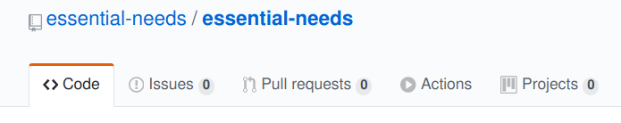

# Essential Needs (Scotland)

## What is this?

This is a repository is intended as a central repository of needs in Scotland at this time of the Covid-19 pandemic.

In this unprecedented time much about life and work does not fit the normal rules, there are are lots of individuals and organisations with needs and lots of people who are stuck at home unable to work.  The aim of this site is to act as a central point where people with knowledge, skill, resources and good ideas can come together to find and respond to needs.

This is a GitHub repository and for those of you who are familiar with open source software development you will understand how this being used to try to harness the wider skills of the community.  Please help.

If your background is not in software then I hope that, with the help of the community we can provide instructions here that will help everyone and anyone to contribute.

Please note that the way this works will inevitably adapt over time, please understand that we are all learning.

## How can I help?

### 1. Respond to needs

The needs can be found in the [`needs` directory](needs) and are linked to [issues](../../issues) where suggestions can be made.

Do you have information, knowledge, contacts or access to resources that could help?

### 2. Find, record and update needs

Try to gather together needs that are already out there but may not be widely known.  If you know of needs directly or have time to search social media for requests for help then please add them to this repository.

## How do I add a need?

To add a need, click on the [issues](../../issues) tab at the top of this screen:

Then click on the Add button and describe the need.

If you are unsure about what to enter, look at other issues.  Over time we will create some better instructions.

Please note that you will need to register with GitHub in order to submit an issue.  Whilst this is currently a small barrier to contributing we hope it is a minor one.

## What are the rules?

Normal rules about privacy and the sharing of data apply.  Nobody should share private information without permission.  Please obtain permission before posting a need, particularly if it contains sensitive information which could include names of individuals and contact details.

That said, at this time there is a risk that the reluctance to share needs may prevent opportunities to address those needs, and in some cases, to save lives.  Please do not be unnecessarily cautious of sharing needs.

Additional rules may be added if we encounter problems with too much information, but in the meantime the only other rule is that the needs should apply regionally to Scotland, UK.  This is not an attempt to exclude anyone, but rather an attempt to manage the amount of information so that it is practical for individuals to act on it.
